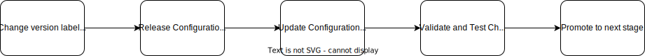

# configuration-composition-template

The repo demonstrates the release process of a Composition Configuration Package.

## Probelm and Motivation

We need to define a release process for crossplane composition which allows us to release new changes on composition by balancing fast rollouts security and stability.
Dev Teams requested more transparency on changelog of composition revisions and requested to pin composition revisions to a specific version.
Currrently we face the following challenges:

- It is possible that provider upgrades can cause breaking changes that are not covered by our existing tests
- We always deploy latest version to all cluster after merge in master. All migration steps (due to breaking changes) have to be done by dev teams immediately
- There is no crossplane diff available like terraform or cdk diff
- Sometimes we do not know wether changes were propagated as expected on existing resources
- The process of validating a change on crossplane provider or composition is not fully automated, we have manual verification steps. This will slow down the release of new composition or providers
- Release Strategy Process is complicated especially for mono-repos: we need a good concept that can be reused
  
## Assumptions

- We use kind local to execute integration tests
- We use ArgoCD to deploy versioned Configuration Packages that contain our compositions
- We have multiple kubernetes cluster with dedicated crossplane installation
- We have a mono-repo with multiple Configuration Packages which makes release process more complex
- The setup for kind-local does not fully reflect the configuration on a production cluster
- We currently use kuttl for testing but want to migrate to chainsaw

## Composition Release Process

- **Simple Semver Versioning**: we use simple major, minor patch version. Major changes require manual approval step while we assume for minor or patch changes we assume automated test and promotion strategy is enough
- **Approval for Major Upgrades**: Breaking changes require manual approval before going to production
- **Usage of Crossplane Packages**: We use package to bundle composition along with required provider versions and push packages as OCI image to registry
- **Pin Composition Revision**: by revision selectors. Claim should be bound to major version by default to allow a working process for breaking changes
- **Notification**: With automation we will push changelog of new composition revision into a a suitable notification channel like slack. So that developers are transparently notified about latest changes
- **Compliance Testing with Kyverno**: We can not directly test compliance on composition level, we actually need to apply rules on managed resources (XR). This can be done either by done by integration test in PR or by advanced testing strategies during stage promotion.
- **Left Shift Testing**: We try to test as early as possible. We use pre-commit hooks to test and validate composition change before test. We provide the option the execute all CI tests locally. More expensive tests like intregation test will be done on CI in PR
- **Advanced Testing for Managed Resources while Promotion**: Changes are pushed from stage dev to staging to prod. On every stage we do a couple of defined tests that will make sure we are compliant and have fully tested our changes and cover blind spot by kuttl tests. Additionally we test the migration of existing resources
- **Automated Testing**: On create PR Event automated integration test will run
Snapshot Testing: We are used to Terraform or CDK diff. However there is nothing similar in Crossplane. It would be good to know the actually changes on XR during PR. We currently do this semi automated
- **Status Reporting**: It's important that we are notified in case the promotion fails at some point.



## Versioning

To release composition version with use **Semver with floating tags**.

- **v1**: This tag is dynamically updated to point to the latest MINOR and PATCH release under the 1.x.x series. It helps users always stay up-to-date with the latest features and fixes within the major version 1 without introducing breaking changes.
- **v1.0**:This tag points to the latest PATCH release for the 1.0.x series. It is useful for users who are satisfied with the features in 1.0 and only want updates for bug fixes within this minor version.
- **v1.0.0**:This is a static tag pointing to a specific release with a specific PATCH level. It guarantees the exact same environment every time it is used, as it refers to a specific build.

```yaml
metadata:
  labels:
    crossplane.io/xrd: xrelationaldatabases.rds.aws.signavio.cloud
    crossplane.io/xrd-version-major: v2
    crossplane.io/xrd-version-minor: v2.1
    crossplane.io/xrd-version-patch: v2.1.3
```

### Compostion Defintion Versioning

Generally we want to **avoid breaking changes** on the CRD scheme. If change is inevitable we use following the kubernetes default api scheme:

1. **Alpha Versions (alpha)** - Initial release versions for internal testing and limited user trials. These are not recommended for production use and can have significant changes in API schema without notice.
2. **Beta Versions (beta)** - Pre-release versions that might still undergo some changes based on user feedback but are more stable than alpha releases. These versions are intended for broader testing and can be used in non-critical production environments.
3. **Stable Versions (v1, v2, ...)** - Released after successive alpha and beta testing and are considered stable for full production use. These versions promise backward compatibility according to semantic versioning rules laid out by the API deprecation policy.

Version iteration Guideline:

- **v1alpha1 to v1alpha2, etc.**
  - Increment when non-backward compatible changes are made to the API that require alterations in the existing client usage or field redefinitions.
  - Useful for iterating rapidly in the early development phases where changes are expected and backward compatibility is not a priority.
- **v1alpha to v1beta**
  - Promote an alpha version to beta when you start to solidify the features and schema, and the API is relatively stable but might still require some changes based on broader user testing.
  - Beta versions should aim to be backward-compatible unless a breaking change is absolutely necessary.
- **v1beta1 to v1beta2, etc.**
  - Increment the beta version when backward-compatible changes are needed. If backward-incompatible changes are necessary, consider adding a migration path or releasing a new version line.
- **v1beta to v1**
  - Transition from beta to stable version (v1) when the API is fully tested, mature, and no significant changes are expected.
  - Ensure full backward compatibility compared to the last beta release. This is critical as v1 versions may be widely used in production environments.
- **v1 to v2**
  - Increment the major version when you make incompatible API changes that do not have a backward-compatible path or when changes are significant enough to require users to alter their applications or automation scripts.

### Process for Schema breakin changes

We want to avoid breaking changes in the schema definition in general. In case we need to introduce a breaking change, we should follow the steps below:

Let's assume we have following schema definiition

```yaml
    - name: v1alpha1
      served: true
      referenceable: true
      schema:
        openAPIV3Schema:
          type: object
          properties:
            spec:
              type: object
              properties:
                data:
                  type: string
              required:
                - data
```

1. add a new version of new schema definition

```yaml
    - name: v1alpah1
      ...
    - name: v1beta1
      served: true
      referenceable: true
      schema:
        openAPIV3Schema:
          type: object
          properties:
            spec:
              type: object
              properties:
                data:
                  type: string
              required:
                - data
                - name
```

2. release a new major version of the package that includes the new schema definition
3. inform the teams about the breaking change and provide them migration steps
4. It might be also possible to execute a migration script as kubernetes job to do necessary migration steps
5. Deprecate the old schema definition by setting `served: false` once all resource have been migration
6. Remove old schemas after a certain period of time

## Testing

### Snapshot Testing

Kuttl Test are great to assert your expected towards the change.
However sometimes it's more practical to see the full changelog on managed resources (XR).
Therefore one very basic form of snapshot testing is to capture the state of all composites and managed resources and write it to git.
The CI pipeline will make sure that the snapshots are updated automatically on PR. The snapshot will be taken at least kuttl step before teardown.

```yaml
snapshot-test:
  desc: "Run snapshot tests"
  vars:
    BRANCH_NAME:
      sh: git rev-parse --abbrev-ref HEAD
  cmds:
    - |
      kubectl get composite -o yaml > snapshot_composites_{{ .BRANCH_NAME }}.yaml
      kubectl get managed -o yaml > snapshot_managed_{{ .BRANCH_NAME }}.yaml
```

When using pipeline syntax it's also possible to generate a snapshot diff locally even with pre-commit hooks.

```yaml
snapshot:
   desc: Snapshot the current state of the composition
   silent: true
   cmds:
   - crossplane beta render composition/examples/claim.yaml composition/apis/composition.yaml function.yaml > test/snapshots/main.yaml
   - git --no-pager diff test/snapshots/main.yaml
```
